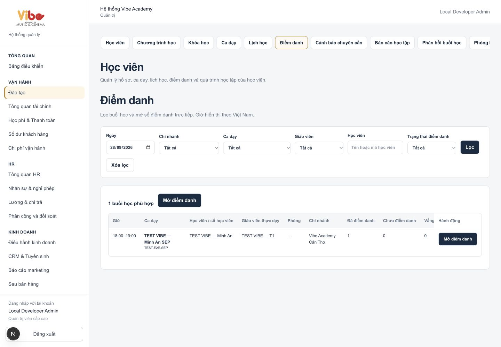
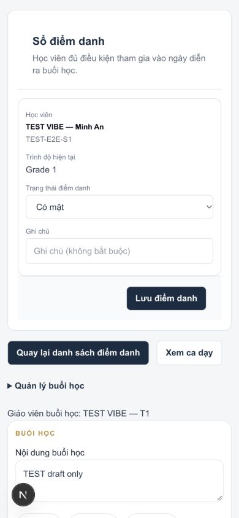
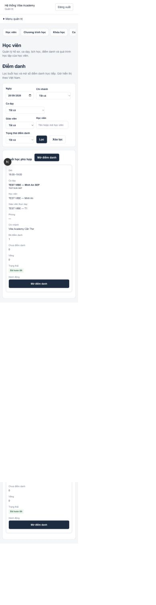
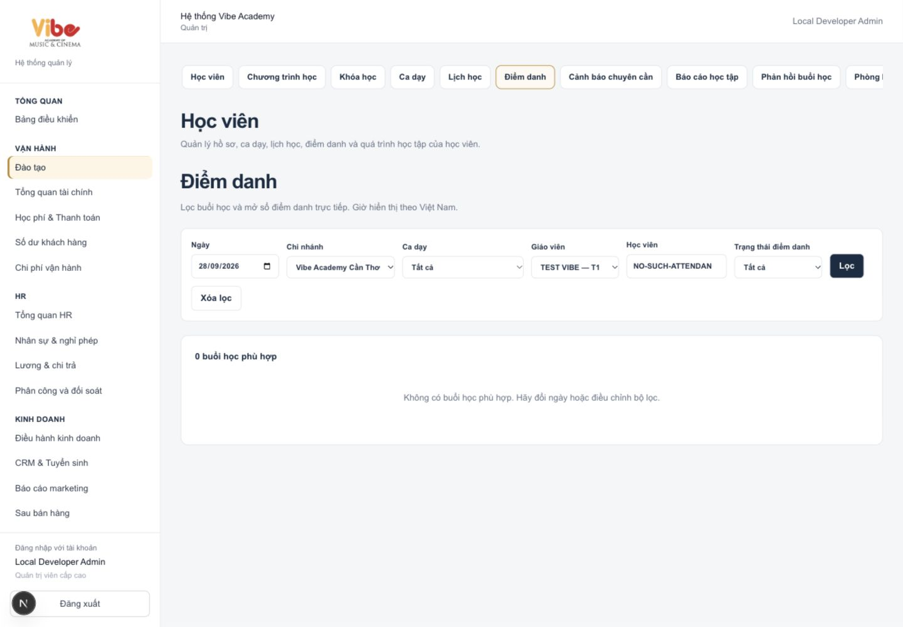

# Student attendance launcher — local verification, 2026-09-28

Implemented in the canonical repository only. Production HOLD: no push or deployment.

The Student Operations Attendance tab now queries dated session occurrences directly. Six server-side filters cover date, authorized branch, shift, actual teacher, student name/code/ID, and attendance completion. The default is the Vietnam business date. Results are limited to 25 per page, with counts and filter choices in the same database request. Filter choices are restricted to authorized sessions on the selected day. No full student or class lists are loaded into the browser.

The read-only migration reuses `can_access_session`, `session_actual_teachers`, and `session_teaching_roster`. It preserves actual/substitute/snapshot teacher resolution, regular enrollment dates, pauses, and explicit makeup participants. Completion counts apply to the eligible roster. Completed attendance sorts last; remaining sessions prioritize those underway, upcoming sessions, and unfinished past sessions. Student searches show matching names and individual attendance labels.

Every launcher action links directly to the existing `/admin/attendance/[occurrence-id]` roster. No class detail is required. The existing roster and canonical attendance statuses/writes are retained. The roster appears before optional session-management panels. Its back links retain the validated filters across saves; it offers the next scheduled occurrence for the same schedule when one exists. Failed roster loads disable saving.

## Verified

- Focused application/bootstrap tests: **13/13 passed** (8 attendance + 5 local bootstrap safety).
- New local pgTAP suite: **22/22 passed** under authenticated role. Covers date, branch, shift, actual teacher, substitute replacement, unrelated teacher denial, student ID/name, explicit makeup, pauses, attendance counts, completion/absence filters, pagination, and completed-last ordering. Tests roll back.
- `npx tsc --noEmit`: **passed**.
- `npm run build`: **passed**, Next.js 16.3.3 Webpack, including TypeScript and postbuild verification.
- ESLint for the changed attendance files, hub, and new test: **passed**.
- Scoped `git diff --check`: **passed**.
- Browser: existing local administrator session; default day and one-result CTA; student `TEST-E2E-S1`, actual teacher and branch filters; direct roster navigation; selected student present with Grade 1; saved PRESENT through the existing action; confirmed success and count 1 marked / 0 unmarked; returned to filtered list; searched an unknown student and verified the empty state without redirect.
- Rendered VIBE review: shared neutral background, navy actions/type, white cards, restrained gold navigation accents, standard filter and badge components. Desktop table stays inside its scroll container. At **390px**, both the launcher and roster use cards; measured document width **390px**, with no horizontal page overflow. Saved roster screenshot shows usable status/note fields and save/back controls.
- Main local development server restarted on port 3000 after the build; authenticated page loads again.

## Wider checks that remain failing

The whole repository is not a clean PASS:

- Full application test run: **740/743 passed**. Remaining failures are `tests/programs-workspace.test.cjs` (test loader cannot resolve `./business/workspaces`), `tests/teacher-session-workspace.test.cjs` (old assertion forbids “Ca dạy” in current navigation), and `tests/zalo-admin-ui.test.cjs` (stale navigation lookup). None of those files was changed for this task.
- Full ESLint: **259 errors, 21 warnings** in the existing repository. Changed attendance files have no lint errors.
- Existing related pgTAP suites (`attendance_records`, `enrollment_pause_attendance`, `teacher_session_workspace`) fail fixture creation with `PLACEMENT_SCHEDULE_REQUIRED` under the newer placement integrity guard. Their original fixtures were preserved. The new attendance suite establishes schedule prerequisites and passes against the same local database.
- Repository-wide diff check reports an existing blank line at EOF in `app/admin/business/crm/actions.ts:162`; that file was not changed for this task.

Authorization boundaries were deliberately retained: the admin shell and the existing SUPER_ADMIN attendance-save guard are unchanged. Teacher/substitute database scope was tested, but a teacher browser login and full teacher save flow were not validated. This work does not grant additional roles entry into the admin shell or new write permissions.

The migration was applied only to `supabase_db_vibe-academy-system`. No reset was performed. The browser save used the existing local TEST VIBE student/session fixture; its attendance is now PRESENT.

## Rendered evidence

